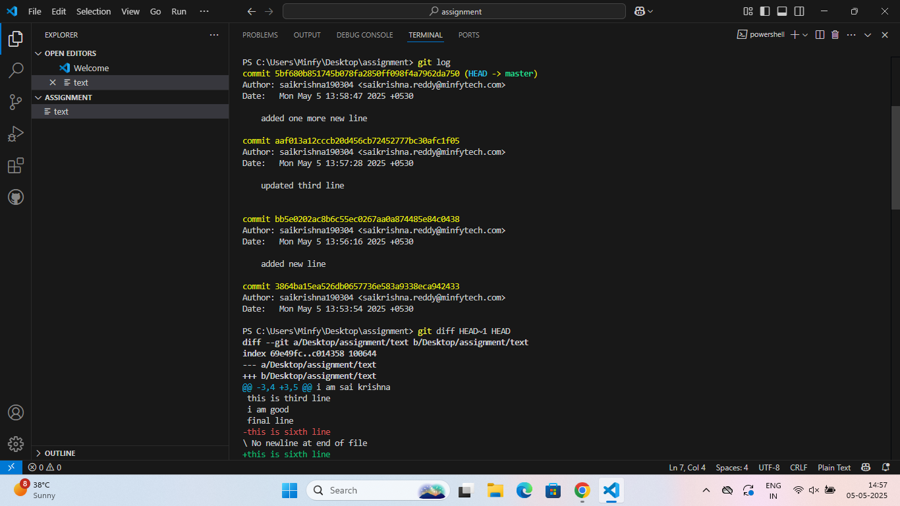

# Assignment1: Basic git workflow  
# objective
To practice fundamental commands and understand the workflow 
# repository setup
-Initialized a local git repository
-created a 'notes.txt' file with initial content
-made 3 meaningful changes 
## commit history(screenshot)
 
## summary of changes
1. created a file named 'notes' and added inital five lines of content.
2. appened a sixth line to the existing file.
3. modified the content of line 4.
4. extended the file by adding seventh line. 
## git log usage
-used gitlog to view the commit history of a repository. 
## git diff usage
-used 'git diff' to inspect the changes between commits.
# Assingment 2 collab Test
This change is made directly from Github.

